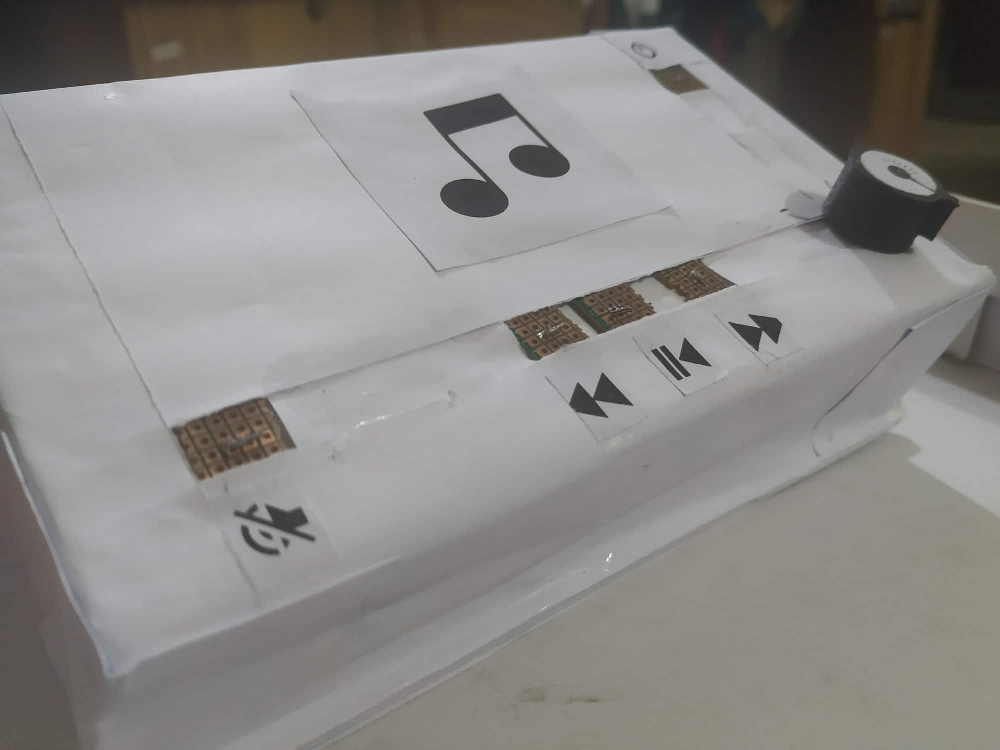
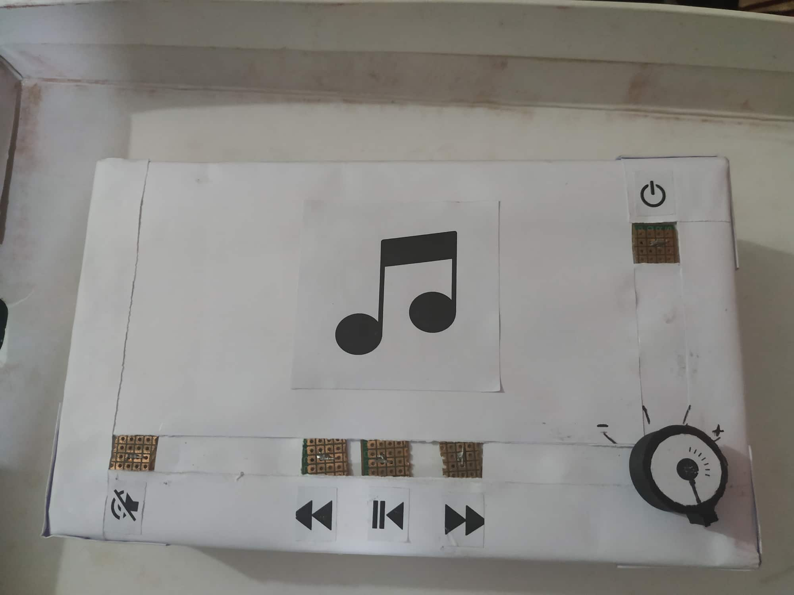

# Mediaplayer-Controller

A basic pot player controller which is powered by esp32 Arduino.

# Credits
* [potplayer project](https://github.com/MacHu-GWU/potplayer-project) - Manipulate potplayer functions  
* [pynput](https://pypi.org/project/pynput/) - library for controlling the keyboard 

# Images:

